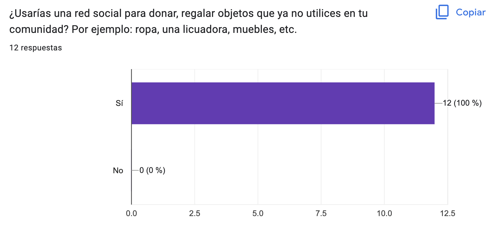
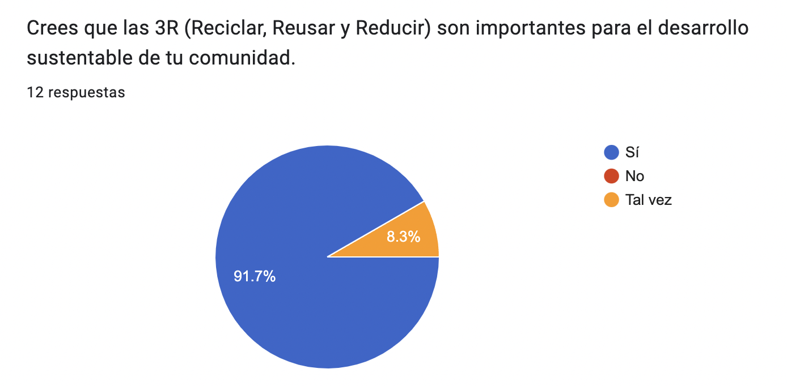

# Social Network por Fer y Angie

## Índice
* [1. Introducción](#1-introducción)
* [2. Definir Usuario y Producto](#2-definir-usuario-y-producto)
* [3. Historias de Usuario](#3-historias-de-usuario)
* [4. Prototipos Baja Fidelidad](#4-prototipos-baja-fidelidad)
* [5. Prototipos Alta Fidelidad](#5-prototipos-alta-fidelidad)
* [6. Áreas de Mejora](#6-áreas-de-mejora)
* [7. Responsive Design](#7-responsive-design)
* [8. Test de Usabilidad](#8-test-de-usabilidad)
* [9. Checklist](#9-checklist)
***

## 1. Introducción
En este proyecto realizamos el desarrollo de una aplicación llamada Recycling 24/7 enfocada en reducir el consumismo con el slogan de “Buy Nothing”. El objetivo principal de la aplicación es que las personas puedan regalar los objetos que ya no quieran dentro de su comunidad, y asimismo que otras personas puedan pedir objetos que necesitan dentro de su comunidad. Está prohibido rentar, vender e intercambiar productos, solo se puede dar y recibir con el fin de apoyar a otras personas dentro de nuestra comunidad, y así reducir un poco el consumismo y aprovechar al máximo la utilidad de los objetos.
[¡Visita nuestro proyecto aquí!](link)

## 2. Definir Usuario y Producto
Para definir el usuario creamos una [encuesta](https://forms.gle/jgeFjwV2M55vEUzS7) sobre nuestra aplicación para saber quienes serian nuestros usuarios principales, qué problema resuelve el producto y para qué le servirá a estos usuarios. 

Se definió hacer una red social en donde en su mayoría para usuarios que están entre 25-35 años. La aplicación proporciona al inicio una vista  donde el usuario puede crear una cuenta con su correo o cuenta de google, al ingresar se encuentra con campos donde puede preguntar si quiere dar o recibir algún producto y otro campo donde puede describir las características de este, de esta manera se crea la publicación, donde se puede editar o borrar.

## 3. Historias de Usuario
Historia 1:
Como: Usuario con un estilo de vida sustentable.
Quiero: Registrarme en la aplicación de ¨Recycle 24/7¨ con mi correo electrónico o cuenta de Google.
Para: Poder ser parte de la comunidad dentro de la aplicación. 
Criterios de Aceptación:
Que pueda registrarse con su correo electrónico o con cuenta de Google. 
Usuario solo puede registrarse con cuenta válida y una contraseña.
Usuario reciba correo de confirmación. 
No puede haber usuarios repetidos. 
La contraseña debe de estar enmascarada. 
Debe correr un test unitario.
Que sea responsive.
Definición de terminado:
El usuario puede registrarse correctamente con su correo electrónico o cuenta de Google en la aplicación.  
Historia 2:
Como: Usuario con una cuenta registrada en ¨Recycle 24/7¨
Quiero: Ingresar a la aplicación con mi usuario y contraseña. 
Para: Poder ver el contenido de la aplicación. 
Criterios de Aceptación:
Que pueda ingresar a la app con su usuario/email y contraseña.
Que arroje un alert cuando usuario/email y contraseña sean inválidos.
Que tenga la funcionalidad de recordar credenciales y quedarse logueados.
Que el usuario pueda recuperar su contraseña en caso de olvidarla. 
Que pueda ver la página de Home.
Debe correr test unitarios.
Que sea responsive.
Definición de terminado:
El usuario puede ingresar y salir de la app con su correo electrónico o cuenta de Google en la aplicación.  
Historia 3:
Como: Usuario dentro de la app ¨Recycle 24/7¨
Quiero: Poder publicar un post en la página de Share regalando un objeto que ya no necesite o pedir un objeto que necesite. 
Para: Poder compartir información de objetos que quiero regalar o pedir dentro de mi comunidad apoyando el uso de las 3R.
Criterios de Aceptación:
Poder publicar un post regalando o pidiendo un objeto 
Debe correr test unitario.
Que sea responsive.
Definición de terminado:
El usuario puede publicar objetos que quiera regalar o pedir dentro de la app.
Historia 4:
Como: Usuario dentro de la app ¨Recycle 24/7¨
Quiero: Navegar la página de Home.
Para: Poder ver el contenido que publican otros usuarios, poder comentar sus posts, darles y quitarles like, y buscar palabras clave dentro de la página de Home. 
Criterios de Aceptación:
Poder scrollear la página de Home.
Poder editar un post.
Poder dar like a su mismo post y posts de otros usuarios.  
Poder eliminar post específico y pedir confirmación antes de borrar un post. 
Debe correr test unitario.
Que sea responsive.
Definición de terminado:
El usuario puede navegar dentro de la página de Home.

## 4. Prototipos Baja Fidelidad
Creamos prototipos de baja fidelidad a lápiz y papel para poder desarrollar nuestra idea e ir mejorándola después de varias iteraciones hasta llegar al resultado que queríamos mostrar. Todos nuestros prototipos fueron creados con “mobile first” ya que la idea es una aplicación para dispositivos móviles.

## 5. Prototipos Alta Fidelidad
Los prototipos de alta fidelidad fueron de gran ayuda para poder desarrollar nuestra idea con CSS, usamos una paleta de color y tambien probamos el contraste con las letras para llegar a nuestro objetivo.

## 6. Áreas de Mejora
Durante el desarrollo del proyecto nos dimos cuenta de algunos puntos que podríamos desarrollar para mejorar la aplicación, a continuación los mencionamos:
Un checkbox que requiera ser marcado para aceptar las reglas de la aplicación antes del registro.
Agregar un loader al cargar las páginas o al cambiarlas.

## 7. Responsive Design
	Durante el desarrollo del proyecto estuvimos haciendo cambios en css para generar una página 100% responsive para la web y otros dispositivos que no son moviles. Se inició con un diseño mobile y posteriormente se fue escalando a pantallas como desktop, ya que fue la manera de poder acomodar ya fuese quitando o agregando elementos para las diferentes vistas.

## 8. Test de Usabilidad

## 9. Checklist
Se cumplieron con los objetivos de este proyecto:

*[X] Desarrollar una SPA con temática de red social

*[X] Aplicar los conceptos de responsividad en el desarrollo de las vistas (templates)

*[X] Implementar un router para la navegación entre las diferentes vistas de la aplicación

*[X] Emplear un servicio externo para la persistencia de datos de la aplicación

*[X] Crear una suite de pruebas unitarias que permitan testear código asíncrono

